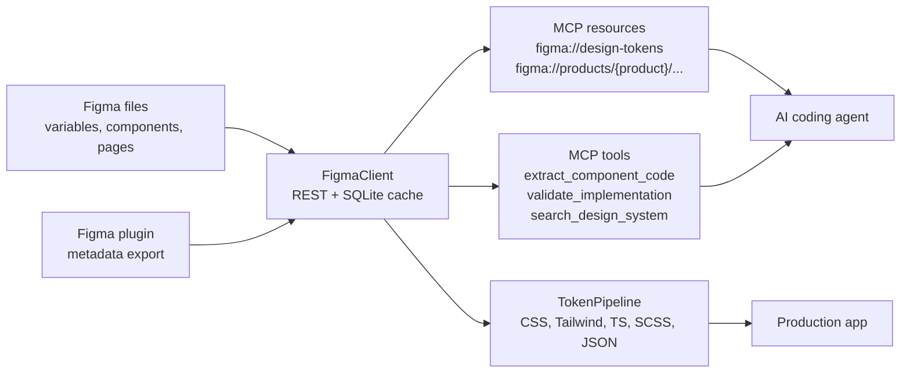

# Figma MCP Bridge

MCP server connecting AI coding agents to Figma design systems: design tokens, component specs, layouts, SVG assets, scaffold generation, and implementation validation.



## Quick Start

```bash
npm install
cp .env.example .env
npm run typecheck
npm test
```

By default `.env.example` starts in `FIGMA_MODE=demo`, which uses realistic mock Figma data for local onboarding and CI. For live users, set production mode and configure one or more real Figma files:

```bash
cp figma.files.example.json figma.files.json
FIGMA_MODE=production
FIGMA_ACCESS_TOKEN=figd_...
FIGMA_FILES_CONFIG=figma.files.json
FIGMA_PRODUCT=web-app
```

`figma.files.json` supports multiple named products/files. Existing single-file setups can still use `FIGMA_FILE_KEY`.

Run MCP over stdio:

```bash
npx tsx src/mcp-server/index.ts
```

Run MCP over SSE:

```bash
npx tsx src/mcp-server/index.ts --transport sse --port 3100
curl http://localhost:3100/sse
```

Generate token outputs:

```bash
npx tsx -e 'import { TokenPipeline } from "./src/token-pipeline/pipeline.ts"; await new TokenPipeline().generateOutputs();'
```

Outputs are written to `generated/tokens/`:

- `tokens.css`
- `tailwind.tokens.js`
- `tokens.ts`
- `tokens.scss`
- `tokens.json`

## Claude Code MCP Config

Use [examples/claude-code-config.json](examples/claude-code-config.json) as a starting point:

```json
{
  "mcpServers": {
    "figma-design-system": {
      "command": "npx",
      "args": ["tsx", "/absolute/path/to/figma-mcp-bridge/src/mcp-server/index.ts"],
      "env": {
        "FIGMA_ACCESS_TOKEN": "your_figma_token",
        "FIGMA_FILE_KEY": "your_file_key"
      }
    }
  }
}
```

## MCP Resources

| Resource | What it returns |
| --- | --- |
| `figma://design-tokens` | Local variables converted to Style Dictionary JSON |
| `figma://components/{component-name}` | Variants, props, sizing, spacing, states, usage notes, and TS props |
| `figma://pages/{page-name}/layout` | Page auto-layout converted into flex/grid guidance |
| `figma://assets/{asset-name}` | Optimized inline SVG for React usage |
| `figma://products/{product}/design-tokens` | Product-scoped variables |
| `figma://products/{product}/components/{component-name}` | Product-scoped component spec |
| `figma://products/{product}/pages/{page-name}/layout` | Product-scoped page layout |
| `figma://products/{product}/assets/{asset-name}` | Product-scoped asset export |

## MCP Tools

| Tool | Purpose |
| --- | --- |
| `extract_component_code` | Generates React, Vue, or Svelte scaffold code from a Figma component |
| `validate_implementation` | Scores code against component spacing, token usage, and accessibility signals |
| `search_design_system` | Searches component names, descriptions, variants, and usage metadata |

## Team Codegen Configuration

Copy `codegen.config.example.json` to `codegen.config.json` when generated code should wrap your team component library instead of scaffolding bare elements:

```json
{
  "teamPackage": "@company/ui",
  "allowedFrameworks": ["react", "vue", "svelte"],
  "componentStrategy": "wrap-existing",
  "tokenNaming": "prefixed-css-var",
  "tokenPrefix": "ds"
}
```

`extract_component_code` respects this config. For example, React output imports `Button` from `@company/ui`, wraps it as `BaseButton`, and uses token references like `var(--ds-color-primary)` rather than raw hex values from Figma. Use `componentStrategy: "scaffold"` when you want standalone starter components.

## Validation And Scoring

`validate_implementation` returns:

```json
{
  "score": 88,
  "issues": [
    {
      "severity": "warning",
      "path": "Button.spacing",
      "message": "Expected spacing value 8px from Figma spec was not found in implementation."
    }
  ],
  "suggestions": ["Address Button.spacing: ..."]
}
```

The scoring mechanism starts at 100 and applies penalties:

- `error`: -25
- `warning`: -12
- `info`: -4

The validator parses TSX with the TypeScript compiler API, extracts string literals and JSX attributes, then cross-checks CSS-like literals such as colors, `px` values, and CSS variables. It also checks for native button semantics or ARIA/role attributes.

## End-To-End Workflow

1. Configure Figma credentials in `.env`.
2. Start the MCP server using stdio for local coding agents or SSE for web agents.
3. Ask the agent to read `figma://design-tokens`.
4. Ask for `figma://components/Button` to inspect variants and props.
5. Call `extract_component_code` for a React/Vue/Svelte scaffold.
6. Paste or pass implementation code to `validate_implementation`.
7. Generate token files with `TokenPipeline`.
8. Import `tokens.css` and generated Tailwind config into the app.

See [docs/END_TO_END.md](docs/END_TO_END.md) for a fuller walkthrough.

## Figma Plugin

The plugin in `figma-plugin/` exports local components, variables, and metadata annotations. It can post the export payload to the MCP server webhook:

```text
http://localhost:3100/webhook/figma
```

The webhook invalidates the SQLite cache so fresh resources are loaded on the next MCP request.

## Docker

```bash
docker compose up --build
curl http://localhost:3100/health
```

## Tests

```bash
npm run typecheck
npm test
npm run build
```

Current suite covers MCP resources/tools, Figma REST/mock clients, transformer helpers, token generation, and the full MCP flow with in-memory transports.

Optional live Figma verification is gated so CI can pass without secrets:

```bash
RUN_LIVE_FIGMA_TESTS=true \
FIGMA_MODE=production \
FIGMA_ACCESS_TOKEN=figd_... \
FIGMA_FILE_KEY=your_file_key \
npm run test:live:figma
```

## Project Structure

```text
src/figma-client      Figma REST client, cache, mock data, transformers
src/mcp-server        MCP resource and tool registration, stdio/SSE server
src/token-pipeline    Token extraction and output generators
src/validators        Implementation parsing and scoring helpers
figma-plugin          Figma plugin exporter
tests                 Unit and integration tests
docs                  Architecture and usage guides
examples              MCP client config examples
```

## Contributing

Keep changes small and covered by tests. Use `npm run typecheck`, `npm test`, and `npm run build` before pushing. New resources or tools should include both an MCP-level test and a focused unit test for their transformation logic.
