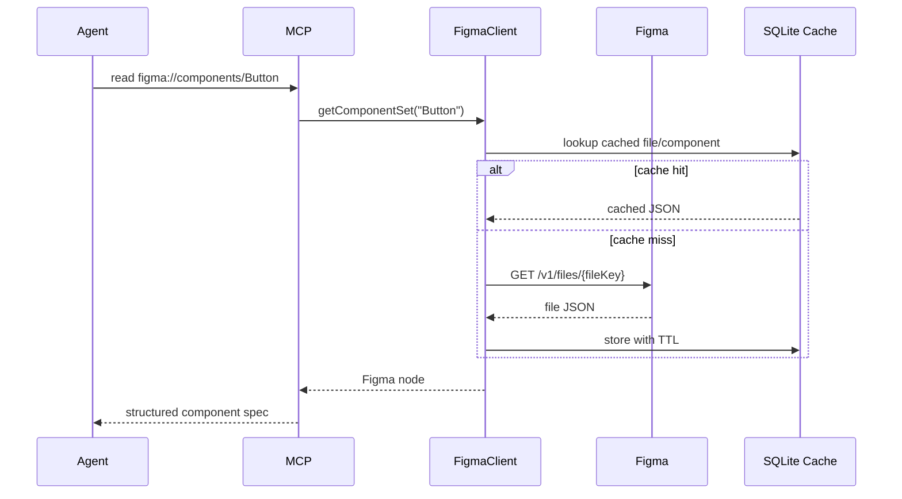

# Architecture

Figma MCP Bridge has four layers:

1. `FigmaClient`: talks to Figma REST APIs, supports demo/production modes, routes multiple named product files, caches responses in SQLite, rate-limits requests, and provides mock data only in demo mode.
2. `Transformers`: convert Figma variables, modes, colors, typography, spacing, radius, shadows, component metadata, layout specs, and React-friendly SVG.
3. `MCP server`: exposes resources and tools over stdio or SSE.
4. `TokenPipeline`: writes production-ready token artifacts for app repositories.

## Runtime Flow



## Cache Strategy

The cache table is intentionally small:

```sql
CREATE TABLE cache (
  key TEXT PRIMARY KEY,
  value TEXT NOT NULL,
  expires_at INTEGER NOT NULL
);
```

Figma file, variable, node, and asset requests use separate cache keys. Asset exports include file key, node id, and format in the cache key so two products cannot collide. The default TTL is five minutes. The plugin webhook calls `invalidateCache()` after a design export.

## Production Figma Reads

`FIGMA_MODE=production` requires `FIGMA_ACCESS_TOKEN` and at least one configured file from `figma.files.json` or `FIGMA_FILE_KEY`. The Variables API parser preserves named modes from Figma variable collections and emits Style Dictionary tokens with a default `value` plus `modes` when multiple modes exist.

Component lookup first inspects document nodes, then falls back to Figma `componentSets` and `components` metadata and fetches the node by id. This supports files where the metadata map is more complete than the visible document traversal.

## Transports

The server supports:

- `stdio`: best for Claude Code and local agent processes.
- `SSE`: best for browser/web agents that need HTTP-based MCP sessions.

SSE exposes:

- `GET /sse`
- `POST /messages?sessionId=...`
- `GET /health`
- `POST /webhook/figma`

## Extension Points

- Add a resource in `src/mcp-server/resources.ts`.
- Add a tool in `src/mcp-server/tools.ts`.
- Add a Figma transformation in `src/figma-client/transformers.ts`.
- Add a token output in `src/token-pipeline/pipeline.ts`.
